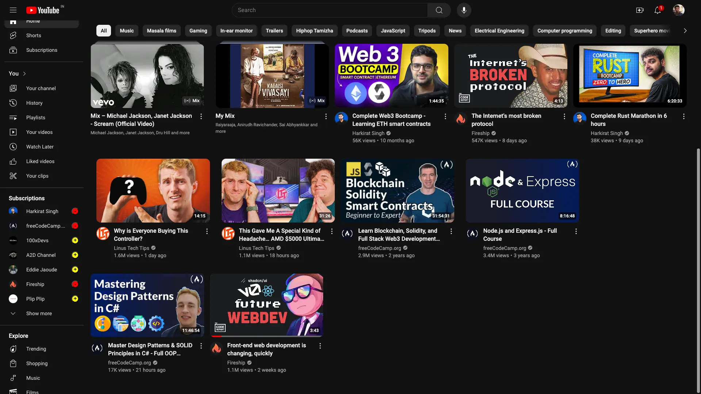

# YouTube Filter Extension

YouTube Filter Extension is a Chrome extension designed to enhance your YouTube experience by allowing you to filter recommendations on the homepage. With this extension, you can whitelist specific channels and block Shorts recommendations, helping you curate a personalized and clutter-free viewing experience.

## Features

- **Whitelist Channels**: Only show videos from your favorite channels on the YouTube homepage.
- **Hide Shorts**: Automatically block Shorts videos from appearing on the homepage.
- **Seamless Integration**: Works smoothly with YouTube's navigation, dynamically filtering content in real time.
- **Lightweight**: Built with performance in mind to ensure a fast and efficient browsing experience.

## Installation

1. Clone or download the repository:
   ```bash
   git clone https://github.com/yourusername/youtube-filter-extension.git
   ```
2. Open Chrome and go to `chrome://extensions/`.
3. Enable **Developer mode** by toggling the switch in the top right corner.
4. Run the build command to generate the production-ready files:
   ```bash
   npm run build
   ```
5. Click on **Load unpacked** and select the `dist` folder (the folder generated from the build command).

## Usage

1. Open YouTube and navigate to the homepage.
2. The extension will automatically filter the homepage videos according to your preferences.
3. To manage the list of whitelisted channels or turn on/off the Shorts block feature, open the extension's popup.

## Development

- This extension is built using **Vite**, **JavaScript**, and **Chrome Extension APIs**.
- To build the extension locally:
  1. Install dependencies:
     ```bash
     npm install
     ```
  2. Run the development build:
     ```bash
     npm run dev
     ```
  3. For production:
     ```bash
     npm run build
     ```

## Screenshot



## Contributing

If you find any issues or have feature requests, feel free to open an issue or submit a pull request.

## License

This project is licensed under the MIT License.
